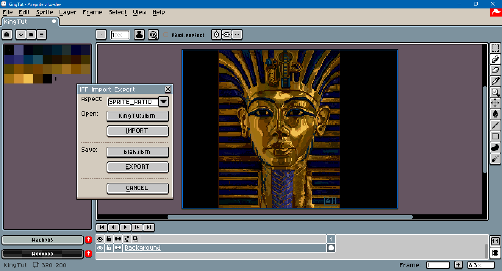

# Aseprite ILBM Import and Export

**PrismaticRealms has released an [Amiga IFF exporter](https://prismaticrealms.itch.io/aseprite-script-amiga-iffilbm-exporter) for Aseprite. Development on this repository will be halted. Please support the development of that project.**

This is a script for the [Aseprite](https://www.aseprite.org/) [scripting API](https://www.aseprite.org/docs/scripting/). It provides **rudimentary** support for importing and exporting `.ilbm` and `.lbm` files from the `.iff` family.

The minimum supported version of Aseprite is 1.2.40.

The image tested in the screen shot above is the King Tut demo, sourced from [here](https://www.randelshofer.ch/animations/anims/electronic_arts/KingTut.ilbm.html).

As this is a work in progress, bugs are likely. Please see the template when reporting issues.

## Download

To download this script, click on the green Code button above, then select Download Zip. You can also click on the `ilbmio.lua` file. Beware that some browsers will append a `.txt` file format extension to script files on download. Aseprite will not recognize the script until this is removed and the original `.lua` extension is used. There can also be issues with copying and pasting. Be sure to click on the Raw file button; do not copy the formatted code.

## Usage

To use this script, open Aseprite. In the menu bar, go to `File > Scripts > Open Scripts Folder`. Move the Lua script into the folder that opens. Return to Aseprite; go to `File > Scripts > Rescan Scripts Folder` (the default hotkey is `F5`). The script should now be listed under `File > Scripts`. Select `ilbmio.lua` to launch the dialog.

If an error message in Aseprite's console appears, check if the script folder is on a file path that includes characters beyond [UTF-8](https://en.wikipedia.org/wiki/UTF-8), such as 'é' (e acute) or 'ö' (o umlaut).

A hot key can be assigned to the script by going to `Edit > Keyboard Shortcuts`. The search input box in the top left of the shortcuts dialog can be used to locate the script by its file name. The dialog can be closed with `Alt+C`. The import button can be activated with `Alt+I`; export, with `Alt+E`.

### Import

This script does not support animation, i.e., files with the `.anim` extension or containing the `ANIM` chunk. The only special flag from the `CAMG` chunk explicity supported is extra half-brite (EHB). Hold only mode (HAM) is not supported. `XBMI` chunks with the `RGB` color format are treated as 24 bit true color; with `RGBA`, as 32 bit true color. Other color formats are not supported.

Color-cycling is approximated, but is not faithful to the original. Multiple color cycles may each have a unique duration. However, on import, overlapping cycles are repeated up to the least common multiple of frames. The average duration is assigned to all cycles. For example, if a file contains two color cycles of 3 and 4 colors, then the resulting sprite would be 12 frames long.

Aseprite seems to partially support [multiple palettes](https://community.aseprite.org/t/sprites-with-multiple-palettes-caveat/14327). However, multiple palettes cannot be created via script. For that reason, color cycling changes the indices of the image on canvas, not the colors in the palette.

An arbitrary pixel aspect ratio can be set in Aseprite through Lua script. However, visual glitches are to be expected from doing so. ILBM frequently uses aspect ratios such as 10:11 or 11:13, and users should expect to zoom out further.

### Export

Exports do not use compression.

No `CAMG` chunk is written by the exporter.

Sprites in grayscale color mode are treated as opaque with a palette with 256 colors.

RGB color mode sprites use true color for the `.ilbm` extension. If the sprite has a background layer, 24 bit true color without alpha is used; otherwise, 32 bit true color with alpha is used. The `CMAP` chunk, which contains palette information, is omitted. For the `.lbm` extension, Aseprite's color matching function is used, effectively treating the source sprite as indexed.

For best results, work with sprites in indexed color mode with a background layer.

A custom sprite properties dialog which allows setting custom pixel ratios can be found at the [AsepriteAddons](https://github.com/behreajj/AsepriteAddons) repo.

## Modification

To modify these scripts, see Aseprite's [API Reference](https://github.com/aseprite/api). There is also a [type definition](https://github.com/behreajj/aseprite-type-definition) for use with VS Code and the [Lua Language Server extension](https://github.com/LuaLS/lua-language-server). I recommend a familiarity with Lua's `string.pack` and `string.unpack` methods. The formats for these methods can be found in Lua's [documentation](https://www.lua.org/manual/5.4/manual.html#6.4.2).

 The primary source on chunk specifications was the [Amiga OS Wiki](https://wiki.amigaos.net/wiki/ILBM_IFF_Interleaved_Bitmap). Test files can be sourced from the [Amiga Graphics Archive](https://amiga.lychesis.net/) and the web site of [Walter and Werner Randelshofer](https://www.randelshofer.ch/animations/).

 Exported files were tested with [IrfanView](https://www.irfanview.com/) with [plugin](https://www.irfanview.com/plugins.htm) to support extra file formats.